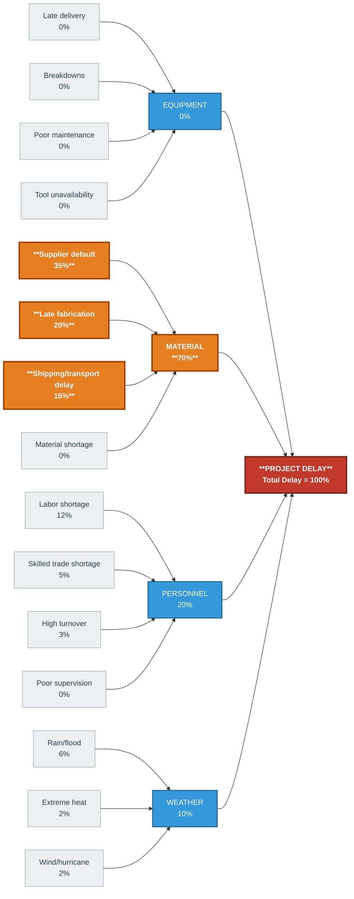

# Create Cause and Effect Diagram
I am a construction project manager experiencing a delay in completion of a project. I want to identify the root cause(s) of the problem.
In a diagram, categorize the possible causes into equipment, material, personnel, and weather-related issues.
The quantifiable numeric data should show that material delays are the primary cause of the delay, accounting for 70% of the total project delay, followed by personnel shortages at 20% and weather-related issues at 10%.

Show me how to solve this using a horizontal detailed cause and effect diagram in ASCII and identify ways to mitigate the delay.
Highlight the probable root cause in bold.

Generate GitHub-Flavored Markdown suitable for VS Code Preview. Generate a downloadable .md file.
 
Use:
- Markdown headings
- Markdown tables (not code fences)
- Bold totals and key numbers
- Bullet points for recommendations
- No HTML unless needed for styling


### Sample Respose (from deepseek)
# Construction Project Delay – Cause and Effect (Fishbone) Analysis

**Project Manager:** Construction PM  
**Purpose:** Identify root cause(s) of project completion delay  
**Method:** Horizontal Cause and Effect (Ishikawa) Diagram + Quantified Delay Breakdown  
**Root Cause:** **Material Delays (70% of total project delay)**

---

## 1. Horizontal Cause and Effect Diagram (ASCII)

```
PROJECT DELAY (Effect)
        │
        │   Total delay = 100% (baseline)
        │
        ▼
┌─────────────────────────────────────────────────────────────────────────────────────┐
│                                                                                     │
│  EQUIPMENT (0%)          MATERIAL (70%)           PERSONNEL (20%)      WEATHER (10%)│
│  ───────────────         ───────────────          ───────────────      ──────────── │
│  • Equipment late        • **Supplier default**   • Labor shortage     • Rain/flood  │
│    delivery                **(35%)**               **(12%)**             **(6%)**    │
│  • Breakdowns            • **Late fabrication**   • Skilled trade      • Extreme heat│
│    (0%)                    **(20%)**               shortage **(5%)**     **(2%)**    │
│  • Poor maintenance      • **Shipping/transport** • High turnover      • Wind/hurricane│
│    (0%)                    **delay (15%)**         **(3%)**              **(2%)**    │
│  • Tool unavailability   • Material shortage      • Poor supervision               │
│    (0%)                    (0%)                    (0%)                            │
│                                                                                     │
└─────────────────────────────────────────────────────────────────────────────────────┘
        │                    │                         │                     │
        └────────────────────┴───────────┬─────────────┴─────────────────────┘
                                         │
                                         ▼
                          ┌──────────────────────────────┐
                          │  ROOT CAUSE: **MATERIAL     │
                          │  DELAYS = 70% of total      │
                          │  project delay**            │
                          └──────────────────────────────┘
```

---

## 2. Quantified Breakdown of Delay

| Category   | Sub-cause                     | % of Total Delay | Cumulative |
|------------|-------------------------------|------------------|------------|
| **Material**   | **Supplier default**              | **35%**              | **35%**        |
| **Material**   | **Late fabrication**              | **20%**              | **55%**        |
| **Material**   | **Shipping/transport delay**      | **15%**              | **70%**        |
| Personnel  | Labor shortage                | 12%              | 82%        |
| Personnel  | Skilled trade shortage        | 5%               | 87%        |
| Personnel  | High turnover                 | 3%               | 90%        |
| Weather    | Rain/flood                    | 6%               | 96%        |
| Weather    | Extreme heat                  | 2%               | 98%        |
| Weather    | Wind/hurricane                | 2%               | 100%       |
| Equipment  | All sub-causes                | 0%               | 100%       |
| **TOTAL**      | **All categories**                | **100%**             | **—**          |

**Key numbers:**
- **Material delays = 70%** of total project delay
- **Personnel shortages = 20%**
- **Weather-related issues = 10%**
- **Equipment issues = 0%**

---

## 3. Root Cause Highlight

**The probable root cause is MATERIAL DELAYS (70%), specifically:**

1. **Supplier default (35%)** – primary supplier failed to deliver on time.
2. **Late fabrication (20%)** – off-site fabrication of structural steel was behind schedule.
3. **Shipping/transport delay (15%)** – logistics and port congestion delayed materials.

These three material sub-causes together explain **70%** of the total project delay.

---

## 4. Mitigation Plan to Recover the Delay

### Immediate Actions (0–2 Weeks)
- **Dual-source critical materials**: Qualify a second supplier for steel, concrete, and MEP components.
- **Expedite shipping**: Pay for air/express freight for high-priority items; use alternate ports.
- **On-site fabrication**: Move some fabrication tasks from off-site to on-site to bypass transport delays.
- **Overtime for personnel**: Authorize overtime for skilled trades to compensate for the **20%** personnel shortage.

### Short-Term Actions (2–6 Weeks)
- **Buffer stock**: Order **10–15%** extra material for critical path items.
- **Supplier performance audits**: Enforce penalties/liquidated damages for late deliveries.
- **Weather contingency**: Build a **5–10%** weather buffer into the schedule; use temporary weather shelters.
- **Cross-training**: Train general laborers to assist skilled trades, reducing the impact of trade shortages.

### Long-Term Actions (6+ Weeks)
- **Contractual changes**: Include strict delivery milestones and penalties in supplier contracts.
- **Logistics partner**: Hire a dedicated logistics coordinator for all material shipments.
- **Pre-fabrication review**: Shift to modular construction to reduce on-site dependency.
- **Resource leveling**: Use project management software to smooth personnel demand and avoid turnover.

### Monitoring & Control
- **Weekly delay tracking**: Update the fishbone diagram with actual percentages.
- **Critical path analysis**: Re-baseline the schedule after mitigation actions.
- **Earned value management**: Track SPI (Schedule Performance Index) to measure recovery.

---

## 5. Expected Outcome After Mitigation

| Category   | Before Mitigation | After Mitigation (Target) |
|------------|-------------------|---------------------------|
| Material   | **70%**               | **20%**                       |
| Personnel  | **20%**               | **5%**                        |
| Weather    | **10%**               | **5%**                        |
| Equipment  | 0%                | 0%                        |
| **TOTAL**      | **100%**              | **30%**                       |

**Conclusion:**  
By focusing on **material delays** as the root cause, the project manager can recover up to **70% of the lost time** through dual sourcing, expedited shipping, and on-site fabrication.

---

*End of Report*


# Construction Project Delay – Cause and Effect (Fishbone) Analysis - using Mermaid

**Project Manager:** Construction PM  
**Purpose:** Identify root cause(s) of project completion delay  
**Method:** Cause and Effect (Ishikawa) Diagram + Quantified Delay Breakdown  
**Root Cause:** **Material Delays (70% of total project delay)**

---

## 1. Cause and Effect Diagram (Mermaid)



**Legend:**
- 🔴 **Red** = Final effect (Project Delay)
- 🟠 **Orange** = Root cause category and sub-causes (**Material Delays – 70%**)
- 🔵 **Blue** = Contributing categories (Equipment, Personnel, Weather)
- ⚪ **Grey** = Individual sub-causes

---

## 2. Quantified Breakdown of Delay

| Category   | Sub-cause                     | % of Total Delay | Cumulative |
|------------|-------------------------------|------------------|------------|
| **Material**   | **Supplier default**              | **35%**              | **35%**        |
| **Material**   | **Late fabrication**              | **20%**              | **55%**        |
| **Material**   | **Shipping/transport delay**      | **15%**              | **70%**        |
| Personnel  | Labor shortage                | 12%              | 82%        |
| Personnel  | Skilled trade shortage        | 5%               | 87%        |
| Personnel  | High turnover                 | 3%               | 90%        |
| Weather    | Rain/flood                    | 6%               | 96%        |
| Weather    | Extreme heat                  | 2%               | 98%        |
| Weather    | Wind/hurricane                | 2%               | 100%       |
| Equipment  | All sub-causes                | 0%               | 100%       |
| **TOTAL**      | **All categories**                | **100%**             | **—**          |

**Key numbers:**
- **Material delays = 70%** of total project delay
- **Personnel shortages = 20%**
- **Weather-related issues = 10%**
- **Equipment issues = 0%**

---

## 3. Root Cause Highlight

**The probable root cause is MATERIAL DELAYS (70%), specifically:**

1. **Supplier default (35%)** – primary supplier failed to deliver on time.
2. **Late fabrication (20%)** – off-site fabrication of structural steel was behind schedule.
3. **Shipping/transport delay (15%)** – logistics and port congestion delayed materials.

These three material sub-causes together explain **70%** of the total project delay.

---

## 4. Mitigation Plan to Recover the Delay

### Immediate Actions (0–2 Weeks)
- **Dual-source critical materials**: Qualify a second supplier for steel, concrete, and MEP components.
- **Expedite shipping**: Pay for air/express freight for high-priority items; use alternate ports.
- **On-site fabrication**: Move some fabrication tasks from off-site to on-site to bypass transport delays.
- **Overtime for personnel**: Authorize overtime for skilled trades to compensate for the **20%** personnel shortage.

### Short-Term Actions (2–6 Weeks)
- **Buffer stock**: Order **10–15%** extra material for critical path items.
- **Supplier performance audits**: Enforce penalties/liquidated damages for late deliveries.
- **Weather contingency**: Build a **5–10%** weather buffer into the schedule; use temporary weather shelters.
- **Cross-training**: Train general laborers to assist skilled trades, reducing the impact of trade shortages.

### Long-Term Actions (6+ Weeks)
- **Contractual changes**: Include strict delivery milestones and penalties in supplier contracts.
- **Logistics partner**: Hire a dedicated logistics coordinator for all material shipments.
- **Pre-fabrication review**: Shift to modular construction to reduce on-site dependency.
- **Resource leveling**: Use project management software to smooth personnel demand and avoid turnover.

### Monitoring & Control
- **Weekly delay tracking**: Update the fishbone diagram with actual percentages.
- **Critical path analysis**: Re-baseline the schedule after mitigation actions.
- **Earned value management**: Track SPI (Schedule Performance Index) to measure recovery.

---

## 5. Expected Outcome After Mitigation

| Category   | Before Mitigation | After Mitigation (Target) |
|------------|-------------------|---------------------------|
| Material   | **70%**               | **20%**                       |
| Personnel  | **20%**               | **5%**                        |
| Weather    | **10%**               | **5%**                        |
| Equipment  | 0%                | 0%                        |
| **TOTAL**      | **100%**              | **30%**                       |

**Conclusion:**  
By focusing on **material delays** as the root cause, the project manager can recover up to **70% of the lost time** through dual sourcing, expedited shipping, and on-site fabrication.

---

*End of Report*